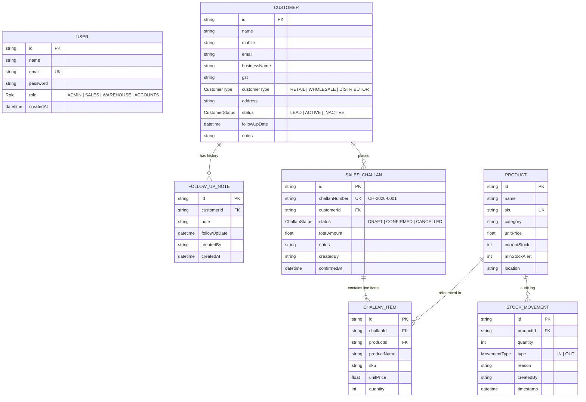

# Technical Architecture & System Design Document

## 1. System Overview

The **Mini ERP + CRM Operations Portal** is an enterprise-grade operational management software designed for wholesale and distribution companies. It unifies Customer Relationship Management (CRM), inventory cataloging, stock movement tracking, and sales order dispatch (Sales Challan generation with atomic stock deduction).

---

## 2. Technical Stack & Deployment Infrastructure

- **Backend**: Node.js, Express.js, TypeScript (Deployed on **Render** Web Service)
- **Frontend**: React, Vite, TypeScript, Lucide Icons, Tailwind CSS (Deployed on **Vercel**)
- **ORM & Database**: PostgreSQL (Hosted on **Supabase** Managed PostgreSQL), Prisma ORM
- **Authentication**: JWT (JSON Web Tokens) with Role-Based Access Control (`ADMIN`, `SALES`, `WAREHOUSE`, `ACCOUNTS`)
- **Validation**: Zod schema validation middleware producing structured `422 Unprocessable Entity` responses
- **Testing**: Automated integration test suite (`test-suite.ts`) covering all 4 modules and deliberate failure cases

---

## 3. Database Schema & Entity-Relationship Diagram



---

## 4. Key Design & Architecture Decisions

### 4.1 Line Item Snapshotting (Historical Integrity)
When a Sales Challan is issued, product information (`productName`, `sku`, `unitPrice`) is **copied and snapshotted** into the `ChallanItem` table rather than relying solely on a dynamic Foreign Key look-up.
- **Why?** In wholesale operations, product prices or SKU descriptions change frequently over time. Snapshotting ensures that past sales challans and legal dispatches maintain exact historical accuracy without being altered retroactively when catalog prices are edited later.

### 4.2 Atomic Database Transactions for Stock Deduction
When confirming a Sales Challan, stock validation and deduction are wrapped inside a single atomic database transaction (`prisma.$transaction`).
- **Pre-Commit Validation**: Stock levels for *all* line items are verified inside the transaction. If any single item has insufficient stock, the transaction immediately rolls back and returns a `422 Unprocessable Entity` response detailing the short product(s).
- **Atomic Deduction & Audit Logging**: Upon successful validation, product stock is decremented and compensating `StockMovement` (OUT) rows are created atomically.
- **Compensation Reversals**: Cancelling a confirmed challan triggers an atomic reversal that creates compensating `StockMovement` (IN) logs and increments product stock back.

### 4.3 Prohibiting Direct Stock Edits via Product API
Direct modification of `currentStock` via the `PUT /api/products/:id` endpoint is strictly blocked and rejected with a `422 Unprocessable Entity` error.
- **Why?** Inventory levels must remain auditable. Stock updates can only occur through explicit, logged actions: manual `StockMovement` records (with a documented reason) or Confirmed `SalesChallan` dispatches.

### 4.4 Production Database Migration vs Local Push Strategy
- **Development**: Local database schema iterations use `prisma db push`.
- **Production (Supabase)**: Production schema deployments use `npx prisma migrate deploy` executing deterministic version-controlled SQL scripts (`prisma/migrations/20260728000000_init/migration.sql`). Connection string pooling (e.g. PgBouncer mode on port 6543 for serverless or direct connection on port 5432) is configured via `DATABASE_URL`.

---

## 5. Folder Structure

```
/
├── backend/
│   ├── src/
│   │   ├── config/          # Database & JWT configurations
│   │   ├── controllers/     # Auth, Customer, Product, Stock, Challan controllers
│   │   ├── middleware/      # Auth JWT, Role RBAC, Zod validator, Error handler
│   │   ├── routes/          # Express route definitions
│   │   ├── utils/           # ApiError, Challan number generator
│   │   ├── app.ts           # Express application setup
│   │   └── server.ts        # Server entrypoint
│   ├── prisma/
│   │   ├── migrations/      # Production SQL migration scripts
│   │   ├── schema.prisma    # PostgreSQL Prisma schema
│   │   └── seed.ts          # Database seed script for 4 user roles
│   ├── test-suite.ts        # Integration test runner
│   ├── package.json
│   └── .env.example
├── frontend/
│   ├── src/
│   │   ├── components/      # Sidebar, Navbar, Portal Layout
│   │   ├── context/         # AuthContext for session management
│   │   ├── pages/           # Dashboard, Customers, Products, Challans, ChallanCreate, etc.
│   │   ├── services/        # Axios API client
│   │   ├── types/           # TypeScript interface definitions
│   │   ├── App.tsx          # Application router & Protected Routes
│   │   └── main.tsx
│   ├── package.json
│   └── .env.example
├── postman/
│   └── Mini_ERP_CRM.postman_collection.json
├── DEMO_SCRIPT.md           # Continuous video recording presentation guide
├── README.md
└── ARCHITECTURE.md
```
